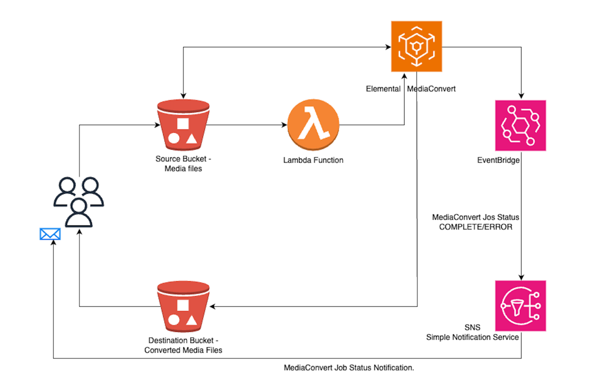
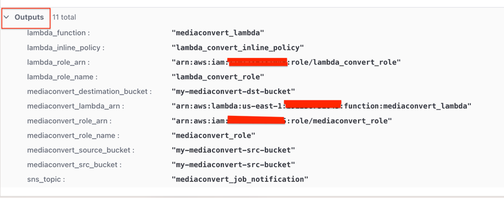

# MediaConvert Automation




Automatically trigger MediaConvert jobs using lambda function and send notifications for MediaConvert job status 

mediaconvert_automation.tf file have deployed resources. Refactor terraform code as needed. 

Resource deployments include.
1. Create Source S3 bucket for media files. 
2. Create destination S3 bucket for converted media files.
3. Create MediaConvert role to process MediaConvert jobs.
4. Creates IAM role for lambda function.
5. Attach inline policy to lambda role.
6. Deploy lambda function to trigger mediaconvert jobs on uploaded media files.
7. Give an external source S3 (source bucket) permission to access the Lambda function.
8. Add trigger for mediacovert lambda function
9. Create SNS topic & email subscription
10. Create a CloudWatch Event Rule to monitor the status of MediaConvert jobs
11. Add SNS topic as target for cloudwatch event rule
12. SNS policy to allow eventbridge
13. Test - Upload mediafile to source bucket , check lambda function triggering mediaconvert job, after complete/error get email notifications,confirm converted media files in destination bucket.

Terraform apply - Outputs




Notes:-
1. In lambda inline policy update your account number. 

```json
{
  "Sid": "VisualEditor0",
  "Effect": "Allow",
  "Action": "iam:PassRole",
  "Resource": "arn:aws:iam::XXXXXXXXXX:role/*"
}
```
2. If you want to restirct permissions more, just restrict to ARNforMediaConvertRole 

```json
{
  "Sid": "VisualEditor0",
   "Effect": "Allow",
  "Action": ["iam:PassRole"],
  "Resource": ["ARNforMediaConvertRole"],
}
```